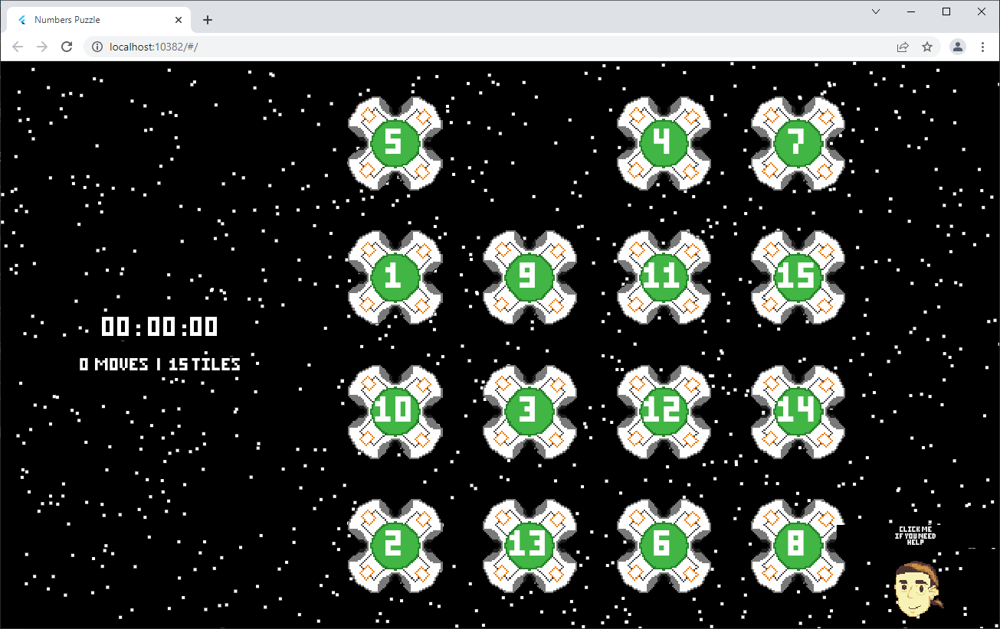
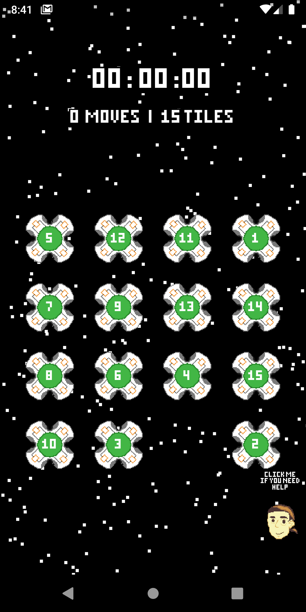
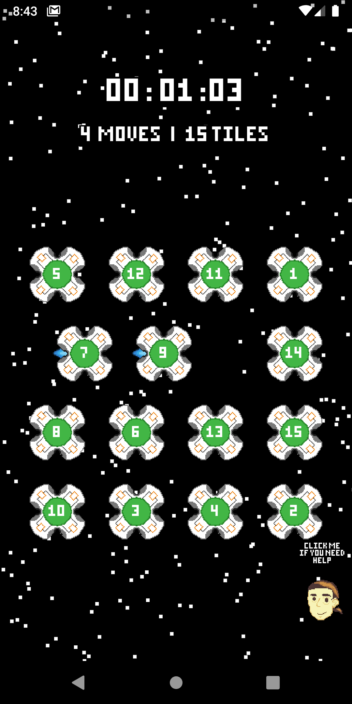
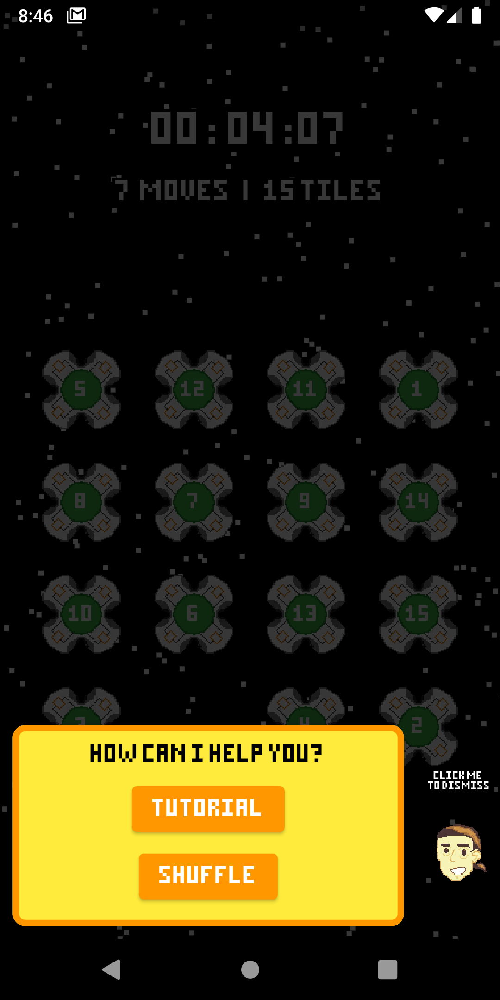
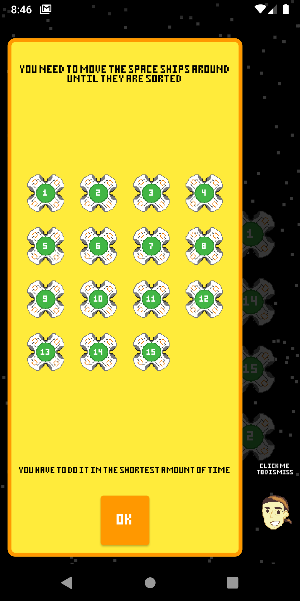
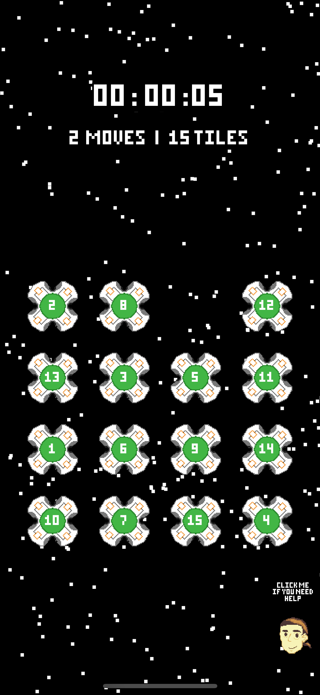
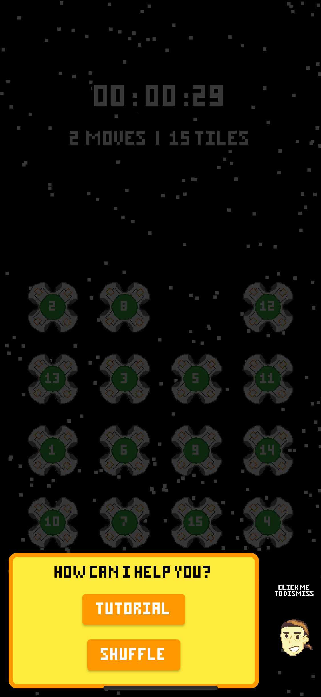
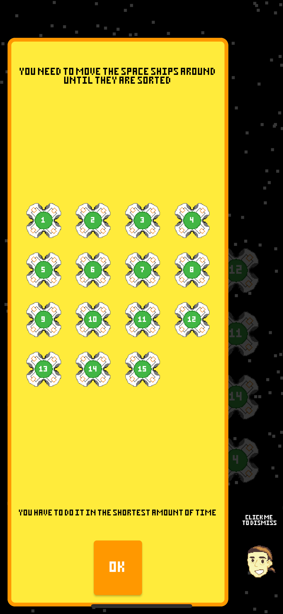

# Numbers_Puzzle
This project is my submission the "Flutter Puzzle Hack 2022". The application keeps the same gameplay logique but offre new kind of user experience with some pixels art in space and no AUDIO. Yes no audio because there is no sound in space. The App can be built for Web , Android and iOS ( the app also support Desktop but there is no point since we have a web version).

# Screenshots
## web

## Android
<table border =0>
<tr>
<td></td>
<td></td>
<td></td>
<td></td>
</tr>
</table>

## iOS
<table border =0>
<tr>
<td></td>
<td></td>
<td></td>

</tr>
</table>

